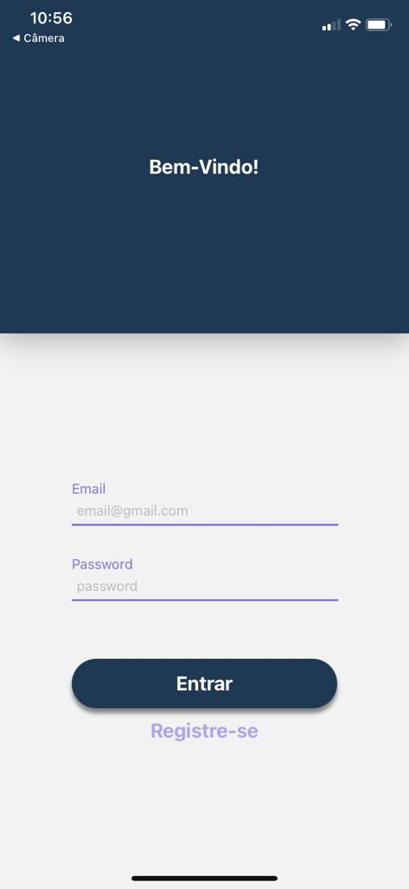
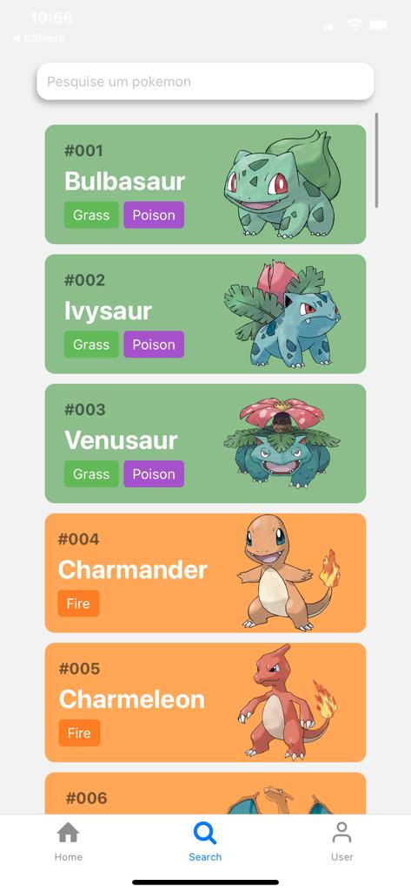
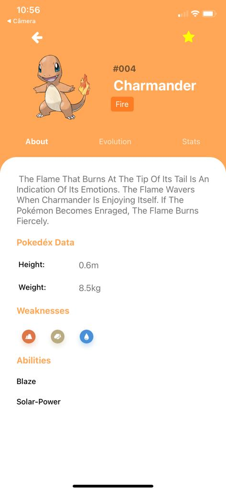
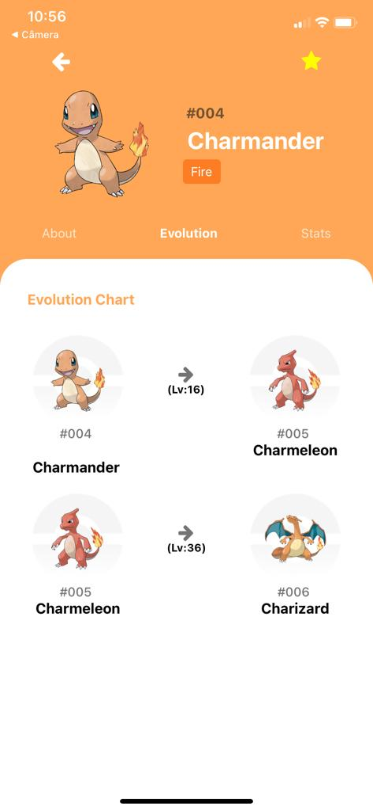
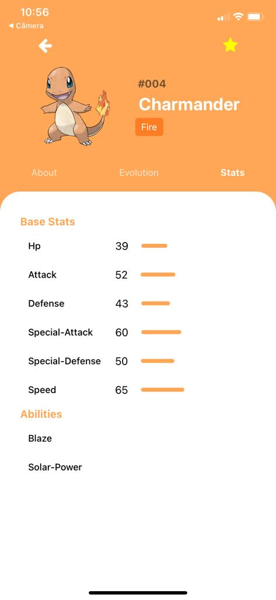
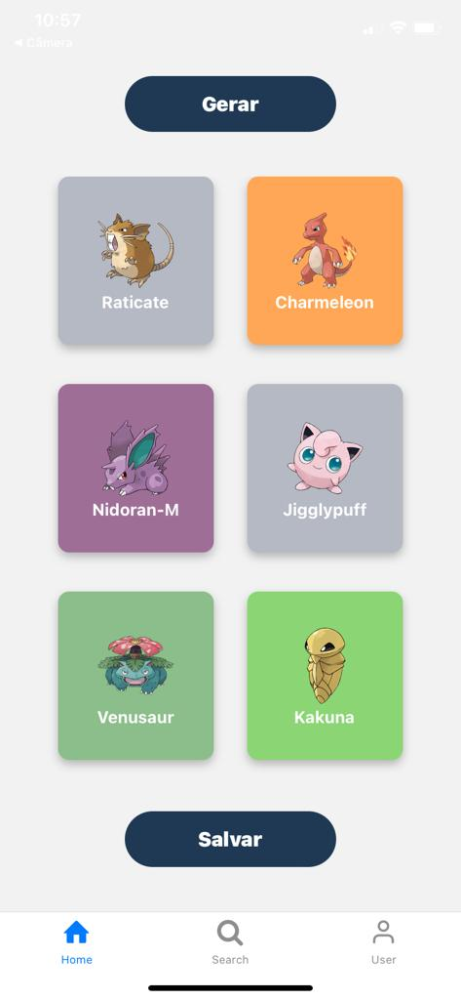
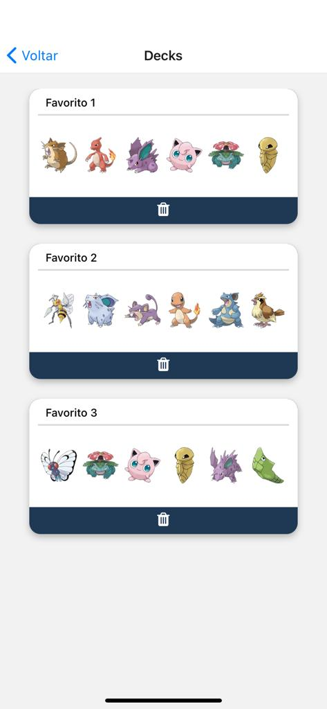
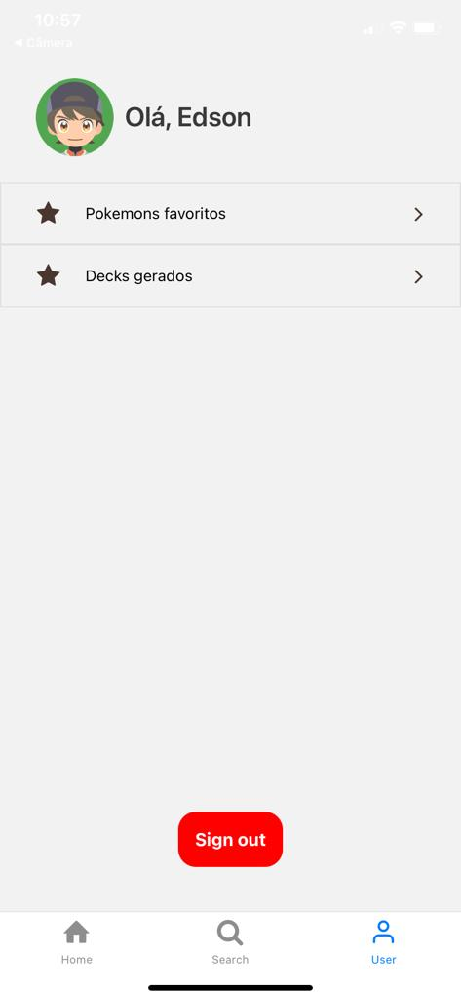

 

  

  <h3 align="center">Pokédex</h3>

  
Table of Contents

  <ol>
    <li>
      <a href="#preview">Preview</a>
    </li>
    <li>
      <a href="#sobre-o-projeto">Sobre o projeto</a>
    </li>
    <li>
      <a href="#funcionalidades">Funcionalidades</a>
    </li>
    <li>
      <a href="#screenshots">Screenshots</a>
    </li>
  </ol>

## Preview
Vídeo de demonstração:  
https://youtu.be/f7dh6FCdT80

## Sobre o projeto
Trabalho final da disciplina de desenvolvimento mobile no terceiro semestre da faculdade de ciência da computação.  
Feito em react native com expo. A api utilizada foi a PokeApi e o firebase está sendo utilizado para o processo de autenticação e armazenamento de dados do usuário.  
A Pokédex é um dispositivo de enciclopédia eletrônica portátil; um que é capaz de gravar e reter informações dos vários Pokémon do mundo. Para atingir o objetivo do Professor Carvalho de um banco de dados Pokémon completo, a Pokédex foi projetada para encontrar e registrar dados dos diversos Pokémons. A principal característica de qualquer Pokédex são as descrições de cada Pokémon individual, que fornecem detalhes da espécie que geralmente seria desconhecida para o treinador.

## Funcionalidades
<ol>
    <li>
    <h2>Criar/Acessar conta</h2>
        <ul>
            <li>
            Para criar uma conta, basta digitar um email e uma senha e clicar no botão "Registre-se" na tela de Login.
            </li>
            <li>
            Para acessar uma conta, basta digitar as informações cadastradas e clicar no botão "Entrar".
            </li>
        </ul>
    </li>
 
    <li>
        <h2>Listar Pokémons</h2>
        Ao acessar sua conta, a primeira tela carregada é a tela de Search. Nela, são carregados e organizados em uma lista os 40 primeiros pokémons. Cada item da lista possui uma cor de fundo (representando o tipo primário do pokémon), mostra o nome do pokémon, seu id e sua foto. Ao chegar no fim da lista, acontece a requisição de mais pokémons na api e a atualização da lista. Dessa forma, com a paginação da api, a lista funciona em infinity scrool, carregando mais itens.
    </li>
 
 <li>
        <h2>Pesquisar Pokémon</h2>
        Para pesquisar um pokémon específico, basta digitar o nome (ou parte do nome) no input. Se for escrito o nome completo, o pokémon pesquisado vai ser mostrado em destaque, se apenas parte do nome for digitado, todos os pokémons que possuem o texto pesquisado vão aparecer.
    </li>
 
<li>
        <h2>Acessar informações de um Pokémon</h2>
        Após clicar em um pokémon exibido na tela de Search, Pokémons favoritos ou Decks gerados, uma tela contendo as   informações do pokémon irá aparecer. Essa tela contém três sub telas que podem ser carregadas clicando em seus respectivos botões.
        <ul>
            <li>
                About:
                 
                Por padrão, ao carregar a tela de informações do pokémon, a tela about irá aparecer. Ela contém um "fun fact",  altura, o peso, os ataques e os tipos que o pokémon possui fraqueza contra.
            </li>
             
            <li>
                Evolution:
                 
                Nessa sub tela, todas as evoluções do pokémon são fornecidas. Também é mostrado o nível em que uma determinada evolução ocorre.
            </li>
             
            <li>
                Stats:
                 
                Nessa sub tela, as estatísticas de um pokémon são mostradas de forma quantitativa e auxiliada de um barra de progresso.
            </li>
        </ul>
    </li>
 
<li>
        <h2>Favoritar Pokémons</h2>
        Na tela de informações de um pokémon, no canto superior direito, está o icon de uma estrela. Clicando no icon, dependendo do estado anterior do pokémon, ele será favoritado ou removido dos favoritos. Se um pokémon está favoritado, a cor da estrela fica amarela, informando que aquele pokémon já está na sua lista de favoritos.
    </li>
     
<li>
        <h2>Gerar Decks</h2>
        Você pode gerar um deck de 6 pokémons aleatórios na tela Home. Uma vez gerado, você pode salvar o deck.
    </li>
     
<li>
        <h2>Consultar Pokémons Favoritos</h2>
        A tela de pokémons favoritos pode ser acessada através da tela Profile. Todos os seus pokémons favoritos são organizados em uma lista e mostrados.
    </li>
     
<li>
        <h2>Consultar Decks Gerados</h2>
        A tela de decks gerados pode ser acessada através da tela Profile. Todos os seus decks gerados são organizados em uma lista e mostrados.
    </li>
     

Fique à vontade para me contatar!

## Screenshots
 
 
 
 
 
 
 
 
